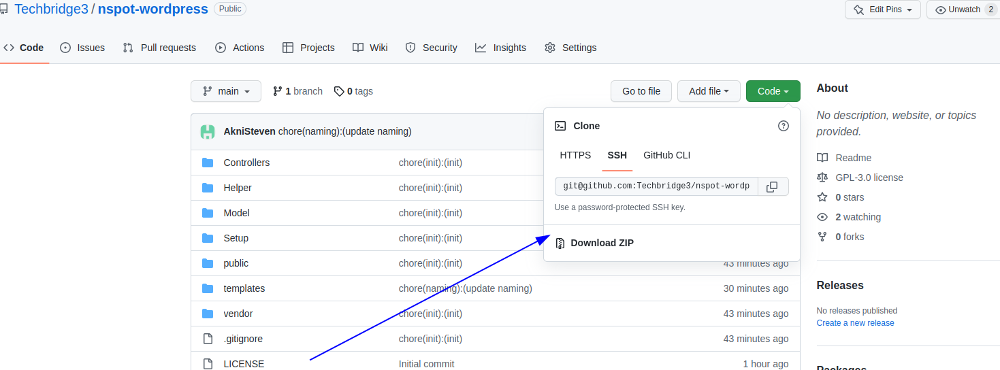
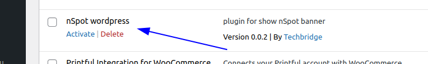
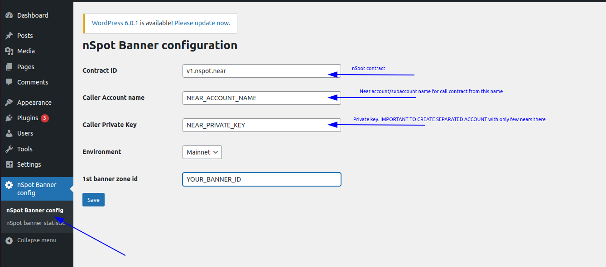
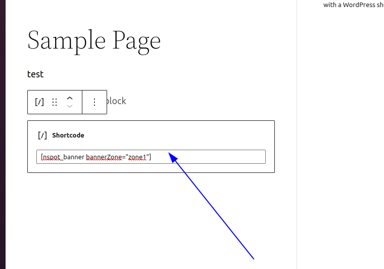
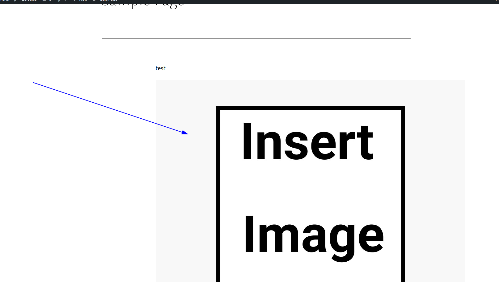

# nspot-wordpress
## WordPress plugin for show nSpot banner on your site

1) DOWNLOAD plugin from this repo and make sure that it has name nspot-wordpress and upload it to your site

!

1) Activate plugins in wp-plugins tab
   
2) Add your configurations
   
3) Insert short code to your site. For now only available option for id - zone1
   
4) Check your banner
   